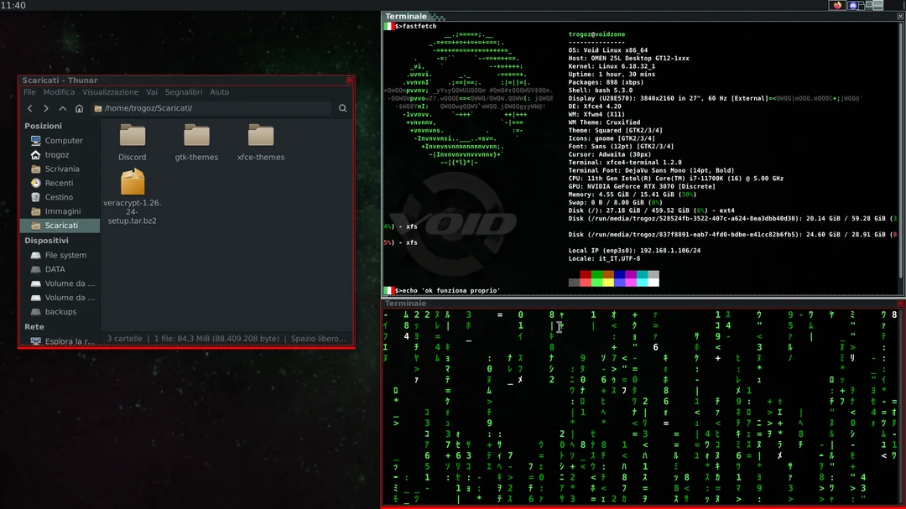

# Voidots


My notes on void linux installation and configuration

---

## Table of contents
- [Intro](#intro)
  - [History](#history)
  - [Installation](#installation)
  - [Style](#style)
  - [Keys](#keys)
- [Software](#software)
  - [Package Manager](#package-manager)
  - [Packages Utility](#packages-utility)
  - [Packages Games](#packages-games)
  - [Extra software](#extra-software)
  - [Gaming and Nvidia](#gaming-and-nvidia-graphics)
- [Hardware and boot](#hardware)
  - [Bluetooth](#bluetooth)
  - [Omen lights](#omen-lights)
  - [Key remaps](#key-remaps)
  - [Grub](#grub)
  - [Lightdm](#lightdm)
- [To do](#to-do)

---
## Intro
First section, including history, style and initial configuration

---
### History
Many years ago I was a passionate "distro hopper", I tried lots, including Frugalware, Ubuntu, Fedora, Mepis, PCLinuxOS, Damn small, Knoppix, Kanotix, Crunchbang and Debian. In 2026 I re-discovered the last one I installed on an old laptop: it was a Debian 8 "Jessie", with files dating back to 2016. 

For ten years work and life kept me away, but on March 30th I finally installed linux again. My initial choice was Rocky Linux 10.1. Gnome 48 is mature, clean, polished, and visually impressive with the right extensions. Flatpaks were initially a charming solution: easy to use, distro agnostic and autosolving dependencies? It appeared too good to be true. Unluckily, soon my home partition was not enough and the flatpak software was isolated and slow... and so was systemd. And then the network printer that I managed to install disappeared: on May 16th it was time to embrace minimalism, it was time to enter the void.

[back](#table-of-contents)

---

### Installation
Chosen XFCE version with GlibC for maximum compatibility
In live context, used the following commands to start installation
```bat
sudo su -
void-installer
```
Created three partitions
| mountpoint | FS | size |
|-------|-------|--------|
|/boot/efi|vfat|1 GB|
|swap|swap|8 GB|
|/|ext4|450 GB|

[back](#table-of-contents)

---
### Style
Minimalism, at last!


I removed every panel, only left a topbar for now.
Created the Cruxified theme, based on Cruxish default theme
```bat
cp -r /usr/share/themes/Cruxish ~/.themes/Cruxified
```
Edited themerc to add colors to borders: white for active window, red for others.
```bat
active_border_color=#AAAAAA
inactive_border_color=#FF0000
```
Since the border was too thin, I also added 4 more lines to the xpm files starting with "bottom", adding 4 to the number of columns (second in the numbers vector of each file).

Gtk3/4 theme: [Squared](https://www.xfce-look.org/p/2206255)

Slightly modified to add custom window color for unselected windows. See line 157 of [gtk3.0 config file](.themes/ReSquared/gtk3.0/gtk.css)

icons theme: [Ant-dark folders](https://store.kde.org/p/1640981/)

Also solved a weird bug in Mousepad. In dark themes the line numbers are highlighted and not visible, like [here](https://github.com/vinceliuice/Qogir-theme/issues/331)

The bug is not present in some colorscheme highlights, located in /usr/share/gtksourceview-4/styles/
I tried to manipulate the classic colorscheme by creating a new one, named "classy", in the appropriate folder:
```bat
mkdir -p .local/share/gtksourceview-4/styles
cp /usr/share/gtksourceview-4/styles/classic.xml .local/share/gtksourceview-4/styles/classy.xml
```
I selected the color for line-numbers as #1d2528 on line 45, see [classy.xml](.local/share/gtksourceview-4/styles/classy.xml).

Somehow, just with this file present the problem solved itself 

[back](#table-of-contents)

---
### Keys
| combination | effect |
|-------|-------|
|super+w| close window|
|super+t| terminal|
|super+f| web browser|
|super+g| thunar|
|ctrl+alt+left/right| change workspace|
|ctrl+alt+shift+left/right| move window to workspace|
|alt+leftclick| move window|
|alt-rightclick| resize window|
|alt+numpad | tile window to screen zones|

[back](#table-of-contents)

---
## Software
Section for software content

---
### Package Manager
Xbps is a fast and compact package management system.

Query the remote packages list with:
```bat
xbps-query -Rs name
```
Update system:
```bat
sudo xbps-install -Syu
```
Add nonfree repo:
```bat
sudo xbps-install -S void-repo-nonfree
```
I also added a couple alias to my [.bashrc](.bashrc):
```bat
alias xi='sudo xbps-install'
alias xq='xbps-query -Rs'
```

[back](#table-of-contents)

---
### Packages: utility
- keepassxc : password manager
- xfce4-screenshooter : for screenshots (with Stamp key)
- libreoffice : documents, work
- engrampa : archives explorer, integrated with thunar
- octoxbps : graphical package manager for xbps
- pdfarranger : pdf editing (merging, splitting, etc)
- SweetHome3D
- vim
- xdotool
- peaclock
- zip
- unzip

[back](#table-of-contents)

---
### Packages: games
- dunelegacy
- prismlauncher
- openjdk25
- steam

[back](#table-of-contents)

---
### Extra software
Software not present in repos, added with installers available on the respective website
- [VeraCrypt](https://veracrypt.io)
- [Discord](https://discord.com/)
- [Heroic launcher](https://heroicgameslauncher.com/)

[back](#table-of-contents)

---
### Gaming and Nvidia graphics
Initially installerd nvidia and steam
```bat
sudo xbps-install -S nvidia nvidia-libs
sudo xbps-install steam
```
To actually use steam it is required to also install 32bit libraries from the repos
```bat
sudo xbps-install -S void-repo-multilib{,-nonfree}
sudo xbps-install -S libgcc-32bit libstdc++-32bit libdrm-32bit libglvnd-32bit mesa-dri-32bit
sudo xbps-install nvidia-libs-32bit
```

[back](#table-of-contents)

---
### Software compilation

#### Updated skippy-xd
Void linux repos contain only a legacy version of skippy-xd [this](https://github.com/antonio-malcolm/skippy-xd), maintained by Antonio Malcolm, with last commits from 10 years ago.
I tested it but the daemon is not able to keep track of windows from other workspaces, and there are clearly no animations.
A more active version is [here](https://github.com/felixfung/skippy-xd). To compile the software we need some compilation tools:
```bat
sudo xbps-install git meson ninja pkgconf
```
and some development libs according to the makefile:
```bat
sudo xbps-install libX11-devel libXft-devel libXinerama-devel libXcomposite-devel libXdamage-devel e libXext-devel
```
then we setup, compile and install:
```bat
meson setup build
meson compile -C build
sudo meson install -C build
```
To configure the 


[back](#table-of-contents)

---
## Hardware
Section for hardware configuration, drivers and boot

---
### Bluetooth
Installed base packages with:
```bat
sudo xbps-install libspa-bluetooth
sudo xbps-install bluez
```
Registered the service and started it and added user to group with:
```bat
sudo ln -s /etc/sv/bluetoothd /var/service
sudo sv up bluetoothd
sudo usermod -aG bluetooth trogoz
```
Then added a GUI manager:
```bat
sudo xbps-install blueman
```

[back](#table-of-contents)

---
### Omen lights
Installed [Omen-light](https://github.com/chiahsing/omen-light)
```bat
sudo xbps-install hidapi-devel
git clone https://github.com/chiahsing/omen-light
g++ -o omen_light omen_light.cc -lhidapi-libusb
```
I created [lux.bash](scripts/lux.bash), added run permissions and made it autorun, adding it to /etc/rc.local

[back](#table-of-contents)

---
### Key remaps
Installed the X11 packages to interact with keybinds:
```bat
sudo xbps-install xev xbindkeys 
```
With xev it is possible to retrieve the button names, for example my mouse buttons are 8 and 9.
Then I generated the base config for xbindkeys
```bat
xbindkeys --defaults > ~/.xbindkeysrc
```
And edited the file to add the workspace switching functionality I needed. To do that the needed package is:
```bat
sudo xbps-install xdotool
```
The resulting config file is my [.xbindkeysrc](.xbindkeysrc)

To autostart the keybinds I added the xbindkeys command to my [autostart](.config/autostart/Keybindings.desktop)

[back](#table-of-contents)

---
### Grub
```bat
sudo mousepad /etc/default/grub
```
Uncommented the lines:
- GRUB_BACKGROUND=/usr/share/void-artwork/splash.png
- GRUB_GFXMODE=1280x1024x32
- GRUB_COLOR_NORMAL="light-blue/black"
- GRUB_COLOR_HIGHLIGHT="light-cyan/blue"

Modified lines:
- GRUB_TIMEOUT=15
- GRUB_CMDLINE_LINUX_DEFAULT="loglevel=4 video=1920x1080-32@60"

Then applied with:
```bat
sudo grub-mkconfig -o /boot/grub/grub.cfg
```

[back](#table-of-contents)

---
### Lightdm
The login manager is way too small for a 4K monitor. I edited the gtk graphics with:
```bat
sudo mousepad /etc/lightdm/lightdm-gtk-greeter.conf
```
Adding the line:
```bat
xft-dpi = 192
```

[back](#table-of-contents)

---
## To do
- [X] overlay clock (dclock is cool, TUI clock? Peaclock!)
- [ ] rougue galaxy in heroic launcher
- [ ] network printer (brother)
- [ ] overlay workspace notifier (partially done)
- [x] Volume keys
- [X] Mouse buttons
- [X] Save dotfiles
- [ ] startup section (rc.local for prior to login (root) and .config/autostart for user)
- [ ] 3D printing and modeling
- [ ] arduino nfc reader and URKA
- [ ] PS1 color for user vs root
- [ ] backup system
- [X] add recovery in grub (it is there!)
- [ ] save grub.conf in here
- [ ] desktop environment? (tiling?) Weyland?
- [ ] AI
- [ ] VR

[back](#table-of-contents)


